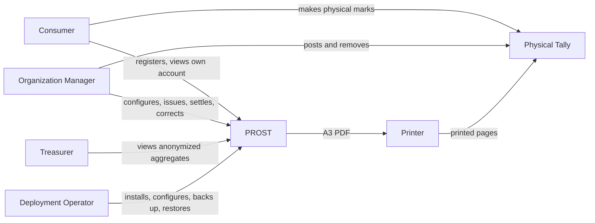
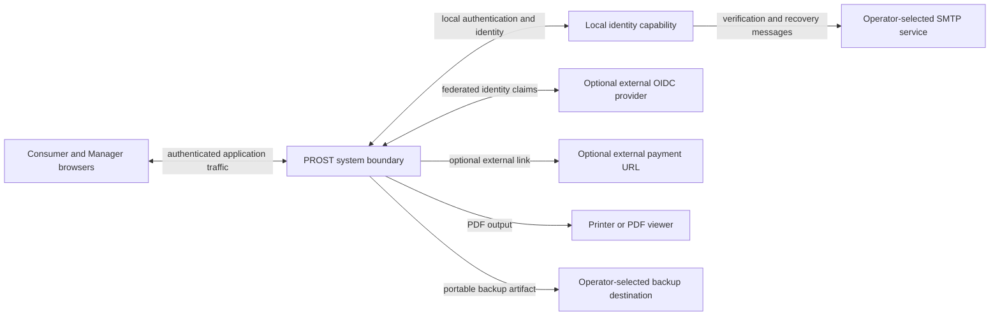

# 3. Context And Scope

Documentation coverage: partial

This chapter summarizes the current, predominantly draft requirements. The diagrams and boundary
lists are architecture context candidates, not accepted system boundaries. Their detailed sources
and maturity remain authoritative in the [requirements index](../../requirements/README.md).

## 3.1 Business Context

PROST manages the digital definition and Settlement of a Tally but does not observe individual
physical marks. The paper sheet remains the source that an Organization Manager manually interprets.

## 3.2 Technical Context

The diagram describes logical external responsibilities, not selected components. A local identity
capability may be embedded, bundled, or separately deployed. Its email verification and recovery use
operator-selected SMTP. An external OIDC provider owns its own verification and recovery behavior.
SMTP, OIDC, payment, printing, and backup destinations remain external contracts.

## 3.3 System Boundary

Inside the target PROST responsibility:

- Organization configuration and application roles.
- Consumer profile and participation state.
- Product catalog and printed layout.
- Tally Snapshot, Settlement, account effects, corrections, and audit history.
- Consumer and privileged user interfaces.
- Anonymized financial aggregates.
- PDF generation and portable application-state backup interface.

Outside the target PROST responsibility:

- Physical honesty, legibility, and preservation of marks.
- Mail delivery infrastructure.
- External identity-provider operation.
- Payment processing and confirmation.
- Printer availability and print quality.
- Backup scheduling and off-host retention.
- Host, DNS, firewall, reverse proxy, and internal-PKI administration.

## 3.4 External Contract Questions

- Which identity protocols and claims prove verified email and manager MFA?
- How are local and OIDC identities linked without account takeover risk?
- What backup artifact and configuration set constitutes a recoverable installation?
- How is explicit private HTTP mode represented and prevented from accidental public use?
